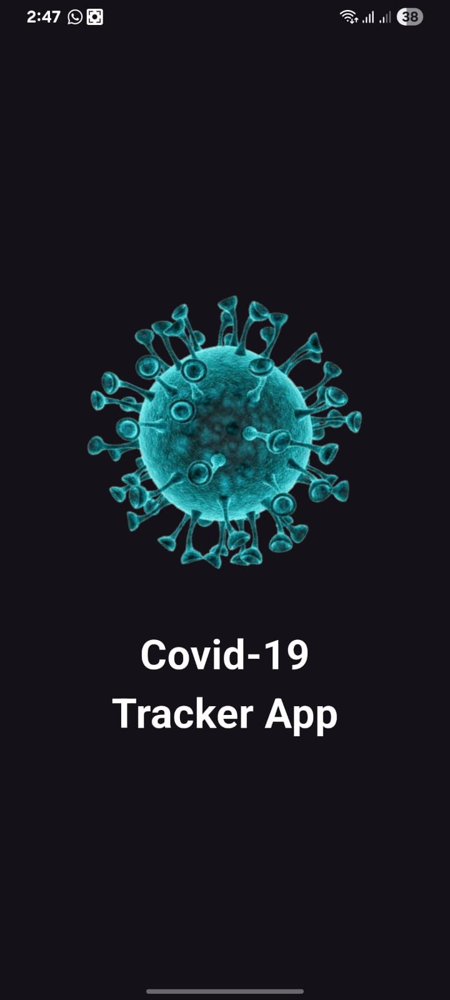
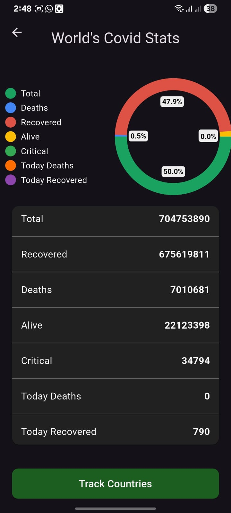
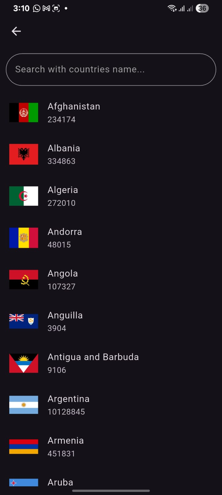
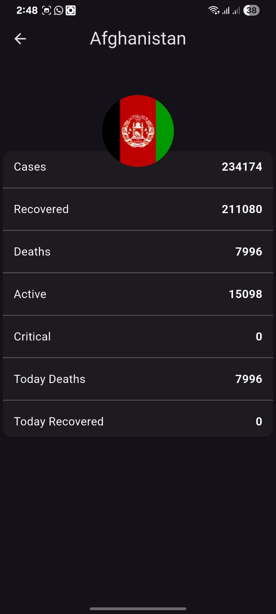
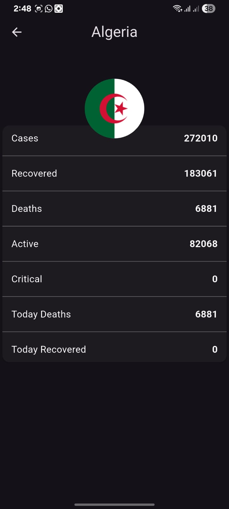

# 🌍 Covid-19 Stats Tracker App (Flutter)

A Flutter mobile application that shows real-time global Covid-19 statistics using a public API. The app provides country-wise tracking and visual data representation through charts.

---

## 📱 Features

- 🌎 Global Covid-19 statistics
- 🔍 Country-wise search
- 📊 Interactive pie chart visualization
- 📈 Detailed country statistics
- ⚡ Real-time API data fetching
- 🎨 Clean and responsive UI

---

## 🛠 Technologies Used

- Flutter
- Dart
- REST API
- HTTP Requests
- JSON Parsing
- Pie Chart Package

---

## 📊 API Used

This app fetches data from the public API:

https://disease.sh

---

## 📸 Screenshots

---

## 🚀 How to Run the Project

1️⃣ Clone the repository

2️⃣ Open the project

3️⃣ Install dependencies

4️⃣ Run the app

---

## 👨‍💻 Author

**Shahzaib Ali**

Flutter Developer | Learning Mobile App Development

---

## ⭐ Support

If you like this project, please consider giving it a ⭐ on GitHub.
